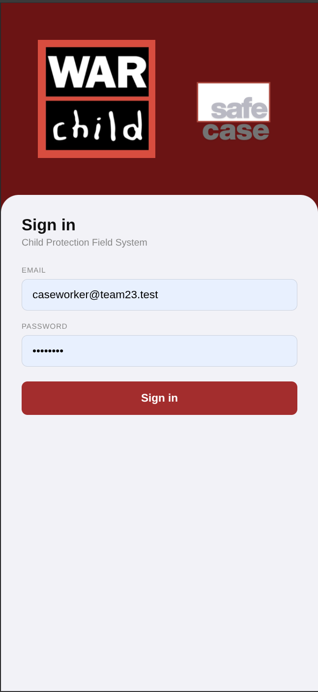
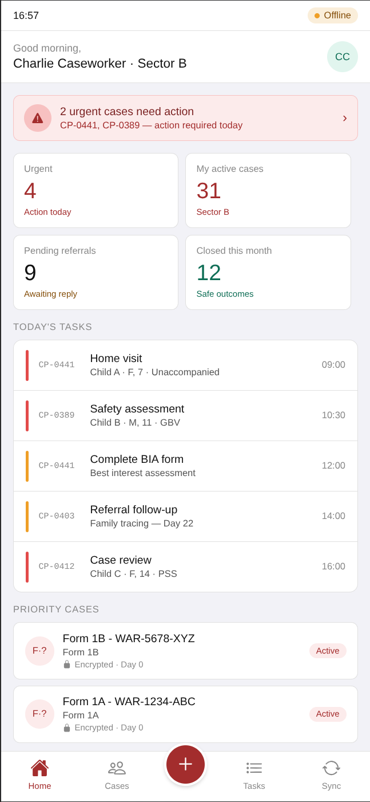
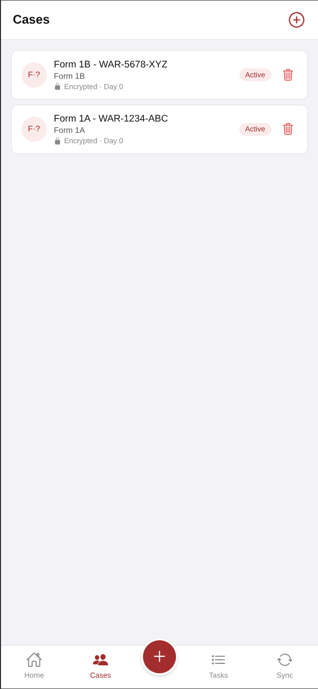
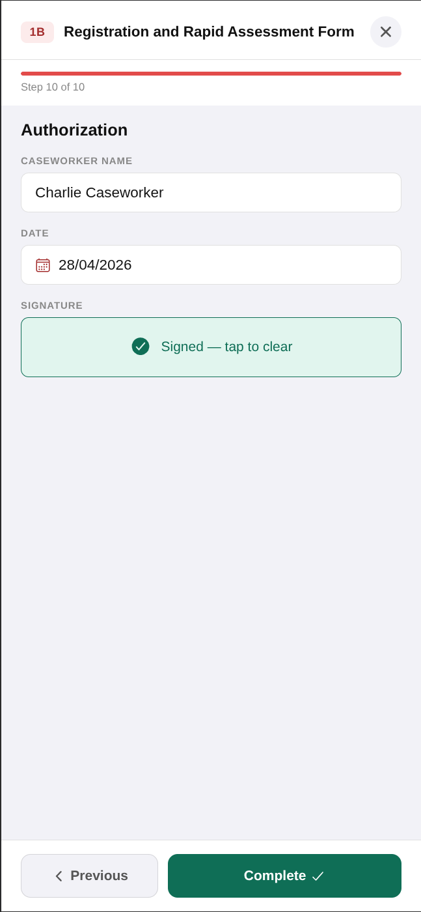
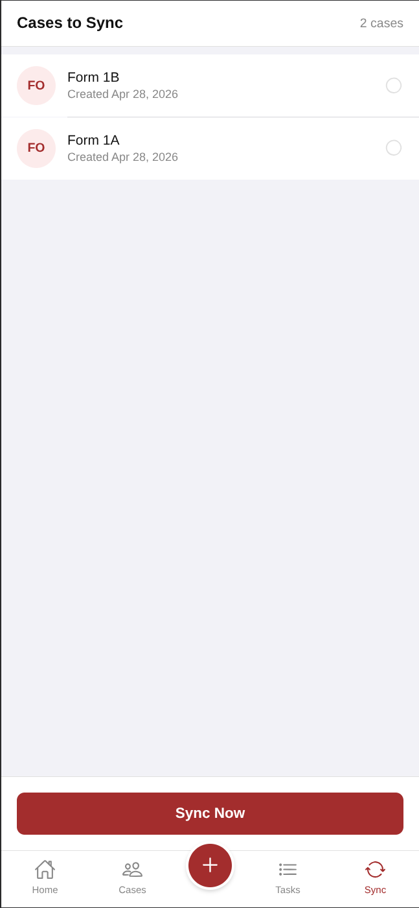
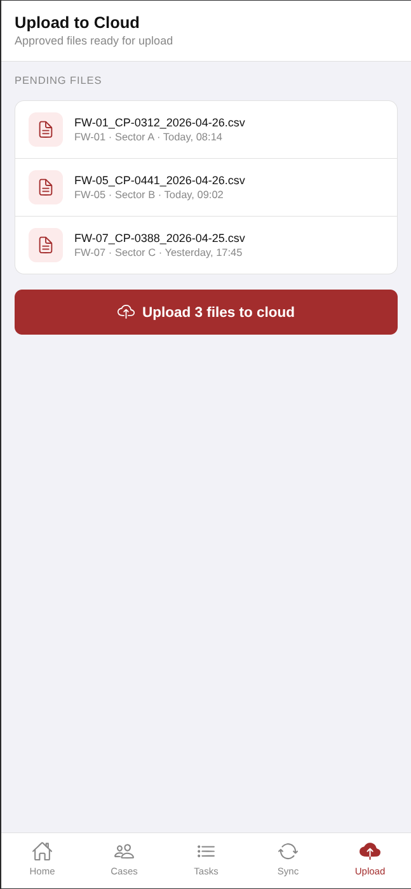

# SafeCase

Mobile-first case management for child protection field workers of War Child. Built for humanitarian contexts where internet access is unreliable or unavailable: cases are captured on-device, stored encrypted at rest, and transferred to a supervisor either over a local network or directly between devices.

Developed at the [Whale x Anthropic hackathon](https://www.whale-academy.com/hackathon) ([Event link on Luma](https://luma.com/whale-hackathon)). Built entirely with Claude Code by Team23: 
* [Quinten van der Laan](https://github.com/qvanderlaan)
* [Brian Jacobs](https://github.com/bjacobs42) 
* [Ally Alombro](https://github.com/ft-ally)
* [Tutku Çakır Yılmaz](https://github.com/tutkuckr)
* [Marie Shulgina](https://github.com/plutopu)

---

## Overview

Field workers operate entirely offline. They record child protection cases using structured CPMS forms on their device. When data needs to reach a supervisor, it is transferred app-to-app - no cloud connection required at that stage. The supervisor reviews, approves, and then pushes the consolidated data to the backend when connectivity is available.


---

## Screenshots

<table>
  <tr>
    <td align="center"><br/><sub>Sign in</sub></td>
    <td align="center"><br/><sub>Caseworker dashboard</sub></td>
    <td align="center"><br/><sub>Cases list (encrypted)</sub></td>
  </tr>
  <tr>
    <td align="center"><br/><sub>Adding and signing a new case</sub></td>
    <td align="center"><br/><sub>Cases ready to sync</sub></td>
    <td align="center"><br/><sub>Supervisor — upload to cloud</sub></td>
  </tr>
</table>

---

## Features

### Offline-first case management
All case data is captured and stored locally on the device. Caseworkers are never blocked by connectivity. The app supports the full CPMS form set:

| Form | Name |
|------|------|
| 1A | Consent |
| 1B | Registration & Rapid Assessment |
| 2  | Comprehensive Assessment |

Each form is rendered step-by-step by a schema-driven `FormWizard` component. Fields include text, date pickers, enumerations, multi-select, integer inputs, and digital signature capture.

### Encryption at rest
All case data passes through `frontend/modules/encryptionModule.js` before touching storage. The pipeline is:

```
raw form object → compact field keys → gzip (pako deflate) → AES-256-GCM → base64
```

The AES-256-GCM key is derived from the user's PIN and device ID via PBKDF2-SHA256 at 100,000 iterations (OWASP 2024 minimum). The derived key is stored in the device secure enclave via `expo-secure-store` and never written to AsyncStorage or plain files. A fresh 12-byte IV is generated for every encryption call via a CSPRNG, so identical inputs always produce different ciphertexts. GCM authentication guarantees that any tampered or corrupted blob is rejected on read rather than returning corrupt data.

The lock icon shown on each case card in the Cases list confirms the record is stored in this encrypted form.

### Role-based access
Two roles govern the application:

- **Caseworker (`user`)** — records cases offline, initiates sync to a supervisor. Has no direct access to the backend API.
- **Supervisor** — receives data from caseworkers, reviews and approves submissions locally, then uploads approved files to the backend. Has an additional Upload tab visible in the navigation.

### App-to-app sync
Caseworkers push completed cases to a supervisor's device over a local network connection. The supervisor reviews the incoming data, selects which cases to approve, and queues them for cloud upload. No internet is required for this stage.

### Cloud upload (supervisor only)
Once a supervisor has approved submissions, they can upload the consolidated CSV files to the backend API over HTTPS. The Upload tab lists all pending files with their origin field worker, sector, and timestamp.

---

## Architecture

### Repository layout

```
team23/
├── backend/          Laravel 13 REST API (PHP 8.4, SQLite, Docker)
└── frontend/         Expo + React Native (TypeScript, Expo Router)
```

Each directory is an independent application with its own dependencies and its own `CLAUDE.md`.

### Frontend

- **Framework:** React Native (TypeScript). Expo is used as the development and testing environment — the production target is a standard native binary (iOS / Android) built via EAS Build or a bare workflow export.
- **Navigation:** Expo Router (file-based). Two route groups: `(auth)` for login, `(tabs)` for the main app.
- **Local storage:** `AsyncStorage` for case metadata; `expo-file-system` CSV files for form content via `services/csvService.ts`.
- **Encryption:** `frontend/modules/encryptionModule.js` — AES-256-GCM with PBKDF2-SHA256 key derivation; uses Web Crypto (Hermes) with an `expo-crypto` fallback for pre-Hermes builds. Keys stored via `expo-secure-store`.
- **Forms:** Defined as `FormDefinition` objects in `frontend/data/forms.ts`. The `FormWizard` component renders them step-by-step with `FormFieldInput` handling each field type.
- **Styling:** Centralised `DashboardColors` palette in `constants/dashboard-colors.ts`. No Tailwind.

### Backend

- **Framework:** Laravel 13 (PHP 8.4)
- **Auth:** Laravel Sanctum token authentication
- **Database:** SQLite in development, configurable via `.env`
- **API:** All routes under `/api/`, gated by `auth` + `supervisor` middleware. Case routes are nested: `GET|POST /api/cases/{case_id}/form-1a`, etc.
- **Models:** `Form1aSubmission`, `Form1bSubmission`, `Form2Submission`

---

## Getting started

### Prerequisites

- Docker and Docker Compose (backend)
- Node.js 20+ and npm (frontend)
- Expo Go on a physical device or an iOS/Android simulator (development and testing only)

### Backend

```sh
cd backend
touch database/database.sqlite
cp .env.example .env
```

From the repository root:

```sh
make up           # build images and start containers
make sh-backend      # open a shell inside the backend container
```

Inside the container:

```sh
php artisan key:generate
exit
```

Back at the root:

```sh
make db-fresh     # run migrations and seed the database
```

The API will be available at `http://localhost:8000`.

### Frontend

```sh
cd frontend
npm install
npx expo start    # choose platform interactively (iOS / Android / Web)
```

The frontend connects to `http://localhost:8000` in development (see `frontend/constants/configs.ts`).

### Useful make targets

| Command | Description |
|---------|-------------|
| `make up` | Build and start the backend in Docker |
| `make down` | Stop containers |
| `make logs` | Tail container logs |
| `make test` | Run backend tests inside Docker |
| `make backend` | Open a shell in the backend container |
| `make db-fresh` | Drop, migrate, and seed the database |

---

## Planned

### Bluetooth peer-to-peer sync
Direct device-to-device data transfer over Bluetooth Low Energy for environments with no local network. Planned to include delta sync, conflict flagging, and verbal PIN pairing for secure device authentication.

### Organisation key distribution
Secure transfer of the organisation encryption key to newly provisioned devices without requiring an internet connection.

---

## Tech stack

| Layer | Technology |
|-------|-----------|
| Mobile app | React Native, TypeScript |
| Dev / test environment | Expo SDK, Expo Go |
| Navigation | Expo Router |
| Encryption | AES-256-GCM, PBKDF2-SHA256, Web Crypto / expo-crypto |
| Secure key storage | expo-secure-store |
| Local persistence | AsyncStorage, expo-file-system |
| Backend API | Laravel 13, PHP 8.4 |
| Authentication | Laravel Sanctum |
| Database | SQLite (dev) |
| Infrastructure | Docker, Docker Compose |
